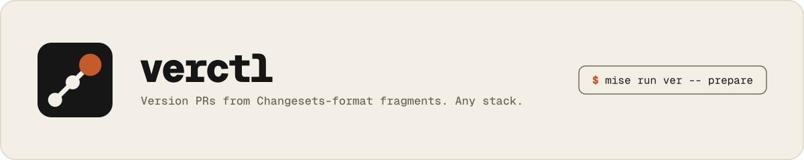

# verctl

<picture>
  <source media="(prefers-color-scheme: dark)" srcset="docs/banner-dark.svg">
  
</picture>

It reads `.changeset/*.md`, bumps declared version files, writes
changelogs, and opens or updates one prepare-release PR.

It is not `@changesets/cli`, not Knope, and not a forkctl verb.

```sh
mise run ver status
mise run ver check
mise run ver prepare
mise run ver prepare --pr
mise run ver publish
```

## Setup

```toml
min_version = "2026.7.7"

[settings]
experimental = true
lockfile = true

[task_config]
includes = [
  "git::https://github.com/victor-software-house/verctl.git//tasks/ver?ref=<tag>",
]
```

```sh
mise run ver status
mise run ver check
mise run ver publish --dry-run
```

Until a GitHub Release exists, build from this repo:

```sh
cargo run -- status
```

## Output

Every command returns one typed report. Pretty, `--color never`, and
`--format json` render the same data. JSON and human errors share that report
contract; JSON errors use stdout, while human errors use stderr. `--quiet`
suppresses only successful human output.

## Fragments

Same file shape as Changesets. YAML fence. Quoted or unquoted keys.

```md
---
forkctl: patch
"@scope/pkg": minor
---

Restore mise.toml when later patches unapply.
```

Allowed bumps: `major`, `minor`, `patch`, `none`.

## Changelog

Rendered with [minijinja](https://crates.io/crates/minijinja) 2.x from
these defaults (override either path):

- [`templates/changelog.jinja`](templates/changelog.jinja)
- [`templates/dependency-changelog.jinja`](templates/dependency-changelog.jinja)

Default release line:

```text
Internal + PR     - Summary ([#12](https://github.com/org/repo/pull/12)).
External + PR     - Summary ([#12](https://github.com/org/repo/pull/12) by [@ext](https://github.com/ext)).
Commit only       - Summary ([`96fb0bc`](https://github.com/org/repo/commit/96fb0bc)).
No link           - Summary.
```

No extra thanks line. If a PR exists, the SHA is omitted.

Author filtering is not a template `if`. Config `internalAuthors` is
matched against the GitHub login for the commit. Those logins get no
byline. Everyone else does.

## Version files

`verctl prepare` applies fragment bumps through **drivers**.
Local writes are the default. `prepare --pr` is the Version PR
(Action happy path; the token is `GITHUB_TOKEN`, not the `gh` account).
`prepare --dry-run` / `--preview` prints the plan and writes nothing.
`prepare --pr --preview` also shows consumed fragments and open vs update.
Cargo and npm are stock drivers, not a separate code path.

A repo's declarations live in one file, `.ctl/ver.yaml`. `.ctl/` is the
directory every ctl CLI shares, so a repo root gains one entry however many of
them it uses.

```yaml
drivers:
  cargo:
    format: toml
    keys: [workspace.package.version, package.version]
    # after is optional. If omitted, verctl looks at lockfiles /
    # packageManager (bun, pnpm, yarn, npm) and Cargo.lock.

  npm:
    format: json
    keys: [version]
    # after: mise run install           # overrides detection

packages:
  - name: verctl
    path: Cargo.toml
    # driver: cargo   # inferred from the file name

  - name: other
    path: VERSION
    read: ver-read-version              # mise run ver-read-version
    write: [printenv, VERCTL_VERSION]
```

A string is a **mise task**. A list is execvp (no shell).
Stdin is the file. Write drivers also get `VERCTL_VERSION`.
Stdout is the version (read) or the new file (write).
`after` is printed, not run.

`0.x` rejects a `major` fragment.

## Runners

Which machines run the work is configuration. A **machine** is declared once
under `runners`; the jobs that run on it name it.

```yaml
# One machine. `labels` is how GitHub finds it — every label at once, so this
# is a single machine carrying three labels, not three machines.
runners:
  big:
    labels: [self-hosted, linux, x64]

# One validation job per entry. Naming two machines gives two checks,
# `verify (big)` and `verify (ns)`. Omit `ci` for one `verify` on ubuntu-latest.
ci:
  verify:
    runners: [big]

# One build target per entry: the name is the job, the tarball, and the
# platform. One tarball is one machine, so `runner` is not a list.
assets:
  darwin-arm64: {}
  linux-x64:
    runner: big
```

| section | one entry is | its name is | with no `runners` / `runner` |
|:--|:--|:--|:--|
| `runners` | one machine | how jobs refer to it | — |
| `ci` | a PR / push validation job | the check name | `ubuntu-latest` |
| `assets` | a release build job and its tarball | the check name, the `--build` argument, part of the filename | the built-in record for that name |

Two sections take runners and no others, because of what config is for here:

> **verctl decides how many jobs there are. Your workflow file decides where a
> fixed job runs.**

A static YAML file cannot declare N jobs without knowing N, and only the repo
knows N. That fan-out is what `ci` and `assets` buy; the machine rides along
on it. Every other job verctl ships — `plan`, `crate`, `pin`, `prepare` — is
always exactly one job, so nothing decides its count and nothing needs to
configure it. Its `runs-on` is one literal in a workflow you own and already
copied from `examples/`:

```yaml
  plan:
    runs-on: [self-hosted, linux, x64]   # yours to edit; no declaration needed
```

So a repo with no hosted runners at all is already served: edit those literals
and declare `ci` / `assets`. `plan` could not read its machine from config
anyway — `runs-on` resolves before the job exists, and `plan` is the job that
reads the declarations.

Names sort alphabetically, not in file order, so a `verify` job written above
an `audit` job still plans `audit` first. Checks are independent, so the order is
display only.

Only `labels` reaches GitHub. A runner **name** is a name in the file: it
resolves against `runners` or fails there, listing what is declared, so a
label can never pass itself off as a machine and verctl never invents a label.
A label GitHub does not know queues the way any wrong label queues — verctl
cannot tell which machines carry which labels, so it passes them through.

Built-in target records, so a public repo needs no config to stay on free
hosted minutes:

| name | labels | `os` | `arch` | `triple` |
|:--|:--|:--|:--|:--|
| `darwin-arm64` | `["macos-latest"]` | `darwin` | `arm64` | `aarch64-apple-darwin` |
| `linux-x64` | `["ubuntu-latest"]` | `linux` | `x64` | `x86_64-unknown-linux-gnu` |

Each field is a default the repo overrides one at a time: naming a `runner`
moves the machine and leaves the platform alone. A name outside that set
describes a platform verctl knows nothing about, so it must describe all of it
— `runner`, `os`, `arch`, and `triple` are all required, and a partial record
is an error rather than a build against an empty target triple. `os: darwin`
renders as `macos` in the filename; that is the only rename. `triple` stays
its own field because the machine and what it builds need not match: an x64
linux runner can build `aarch64-unknown-linux-gnu`.

`ci` is exactly as trusted as `.github/workflows/ci.yml`: for a
`pull_request` event both come from the pull request's own tree, so a fork PR
that can declare a label could equally have written that label into the
workflow file. Neither is a reason to expose a self-hosted runner group to a
public repository — keep `allows_public_repositories=false` there and keep
fork-PR approval on, and read declared labels as untrusted input in a repo
where that is not true.

`verctl ci` and `verctl assets` print what resolved, so a default is visible
output rather than an assumption. Both also write a matrix for
`$GITHUB_OUTPUT`: GitHub needs `runs-on` before a job exists, so a small
`plan` job emits the labels and the real jobs consume them
([`examples/workflows/ci.yml`](examples/workflows/ci.yml)).

## Actions

These replace `changesets/action`. They are **GitHub Actions, not a
GitHub App**. The runner already has `git` and `GITHUB_TOKEN`. PRs are
opened with octocrab. Commits and push are `git2` with that token,
not the `git`/`gh` CLIs. There is no local token setup.

| Action | Role |
|:--|:--|
| [`actions/version-pr`](actions/version-pr/action.yml) | Open or update the Version PR |
| [`actions/publish`](actions/publish/action.yml) | Run after that PR merges |
| [`actions/asset`](actions/asset/action.yml) | Build and attach one native target |

Example consumer workflow: [`examples/workflows/version-pr.yml`](examples/workflows/version-pr.yml).

Mise owns tools. Publish uses Actions OIDC, not a PAT.

## License

MIT.
